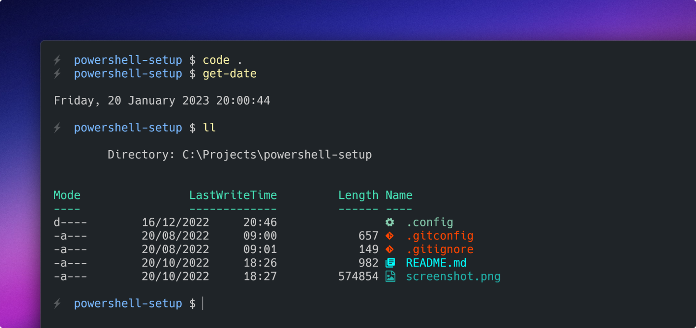

# PowerShell setup for Windows 11

- [Oh My Posh](https://ohmyposh.dev/) - Prompt theme engine
- [Terminal Icons](https://github.com/devblackops/Terminal-Icons) - Folder and file icons
- [PSReadLine](https://docs.microsoft.com/en-us/powershell/module/psreadline/?view=powershell-7.2) - Readline library
- [PSFzf](https://github.com/kelleyma49/PSFzf) - Fuzzy completion engine
- [Scoop](https://scoop.sh/) - Command line tool
- [GitHub CLI](https://cli.github.com/) - Command line interface
- [Nerd fonts](https://github.com/ryanoasis/nerd-fonts) - Powerline font `I use Hack`
- [z](https://www.powershellgallery.com/packages/z/1.1.13) - Directory jumper

## Setup

Add a code snippet to `Microsoft.PowerShell_profile.ps1`

```powershell
# Load custom PowerShell profile
. $env:USERPROFILE\.config\powershell\profile.ps1
```

> Don't blindly use my settings unless you know what that entails 🤓 Use it at your own risk.